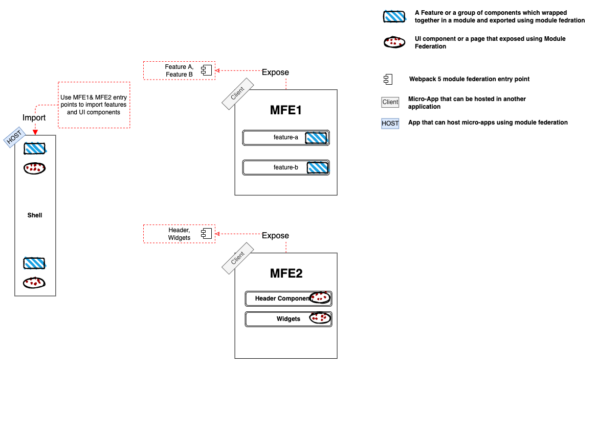

# Exploring Micro-Frontend using Webpack 5 module federation
> At the time This project was developed, the latest Angular version was v11 that doesn't support webpack 5 by default and it's needed to explictily set the webpack version in package.json and to use `yarn` and not `npm`.

# Table of content
- [Installation](#Installation)
- [Understand the workspace](#Understand-the-workspace)
- [Module Fedration](##Module-Fedration)


---
# Installation

Install the dependencies using `yarn` 

```
yarn install
```
>**`yarn`  is needed to use the provided webpack version resolutions in package.json**

Run the Shell and the micro-frontend
```
yarn start
```
Will run the shell on [http://localhost:4200/](http://localhost:4200/), mfe1 application on [http://localhost:5000/](http://localhost:5000/), and mfe2 on [http://localhost:5200/](http://localhost:5200/) 

# Understand the workspace



An Angular workspace that is consists of three angular applications:
## shell:
### Angular application (`host`) that has moduler fereation setup and able to import modules or components from other micro frontends that expose features using module feration. `In this app we provide UI to import features and component dynamically from MFE1 and MFE2`.
<br>

## mfe1: 
### Angular Application (`remote`) that has moduler fereation setup to expose feature modules `mfe1 application exposes (feature A, Feature B)`.

----
<br>

## mfe2: 
### Angular Application (`remote`) that has moduler fereation setup to expose feature modules `mfe2 application exposes Header component and widgets`.
## Module Fedration
### What is module fedration?


- Module federation is a new feature in Webpack 5 which allows the loading of separately compiled program parts that are not yet known at compile time. In addition, the individual program parts can share libraries with each other so that the individual bundles do not contain any duplicates and the bundle file will remain small.
- before webpack 5, webpack assumes everything is compiled through compile-time and you cann't lazy load any feature from a remote URL. we had several workarounds but it's the first official solution to make it possible and make micro-frontend easier than ever.
- The application which exposing the code parts called `remote` and the one that use this parts called `host`
    > A `host`: a Webpack build that is initialized first during a page load (when the onLoad event is triggered).

    > A `remote`: another Webpack build, where part of it is being consumed by a “host”
